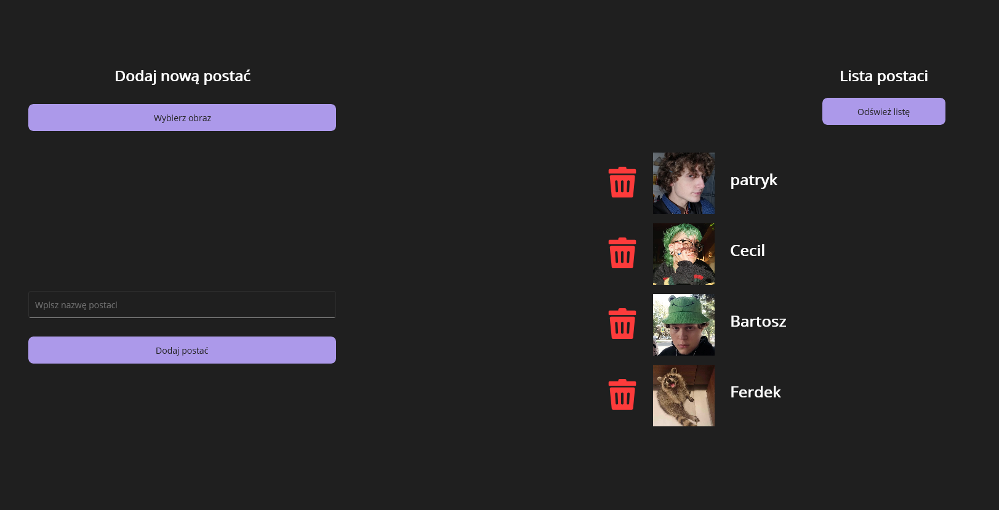

## -- 13.02.2025 STILL IN DEVELOPMENT --

# WhatWouldTheyDo
App that creates charts with locally created characters. 

## Description
WebApplication1 is an ASP .NET web app that holds the database (I used DB Browser to manually add context to database)
MauiApp1 is a Maui frontend app that lets you locally create characters and then assigning them to various charts.

## Creating characters

## Creating charts

